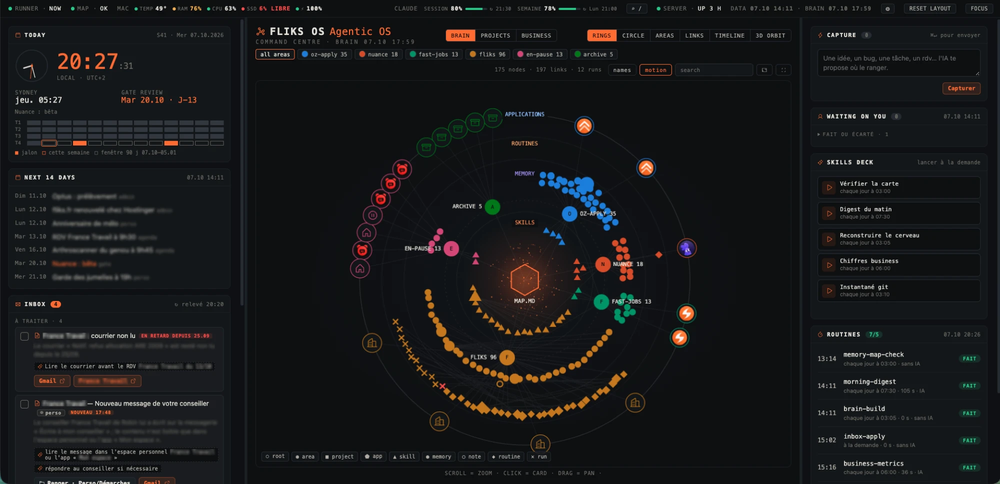

# Agentic OS Kit

<p align="center"></p>

**Your own AI operating system, on your computer, built around how *you* work.**

Agentic OS Kit turns [Claude Code](https://claude.com/claude-code) into a personal command centre:

- 🧠 **Memory** — a map of everything you work on, so Claude finds any fact in two steps, checked every night.
- ⏱ **Routines** — small tasks that run on a schedule and prepare things for you (a morning digest, stats, reminders, a weekly review), with cost caps.
- 🖥 **Dashboard** — a private page on your computer: Today, your pages, a living brain graph of your work, a skills deck, your routines, Claude quota and computer health, a "/" palette to search your files or ask Claude.
- ✦ **Skills** — your repeated tasks as one-click or one-sentence skills.

The repository contains **no one's data and no pre-made setup**. When you open it in Claude Code, a
guided setup (10 short "cards") interviews you — what you do, your week, your tools, what you forget —
and then builds *your* OS: only the panels, pages, routines and skills that are useful to you. A video
creator gets a Content page, a freelancer a Clients page, a student an Exams page.


## Install (15 minutes, then the guided setup)

👉 **Step-by-step guide for non-developers: [INSTALL.md](INSTALL.md)** · 🇫🇷 [Version française](README.fr.md)

Short version, if you are used to the terminal:

```bash
git clone https://github.com/Robingbf/agentic-os-kit.git ~/agentic-os
cd ~/agentic-os
bash setup.sh        # checks Python, Claude Code, creates the private folders
claude               # then just say: "hi, let's set up my OS"
```

Requirements: macOS or Linux (Windows via WSL2), Python 3.10+, Claude Code with a Claude Pro / Max /
Team plan (or an API key). Everything else is standard library — no npm, no build, no database.

## How the setup works

| Card | What happens |
|---|---|
| 00 Welcome | language, prerequisites, your plan, timezone, a name for your OS |
| 01 Interview | who you are, your week, obligations, what slips — one question at a time |
| 02 Tools | your apps, files and connectors (Gmail, Calendar, Notion, Drive…), what is missing |
| 03 Memory map | your areas of work, the two-hop map, the nightly check |
| 04 Blueprint | the design of *your* OS: panels, pages, routines, skills, costs — you validate it |
| 05 Routines | your scheduled tasks, read-only, tested once each |
| 06 Skills | your on-demand skills and the skills deck |
| 07 Dashboard | your dashboard live, walkthrough, colours |
| 08 Automation | scheduler, session journals, backups — each with your explicit yes |
| 09 Handover | final checks, monthly cost, how to use and change it |

You can pause at any time and continue later; the setup resumes where you stopped.

## Safety by design

- Runs **locally** (dashboard on 127.0.0.1 only). Nothing is sent anywhere except through Claude.
- Routines are **read-only**: tools that send, share, delete or modify are denied. The only outward
  actions (e.g. filing an email) happen on your click, with validated parameters.
- Emails, web pages and files are treated as **data, never instructions** (prompt-injection defence).
- Secrets are masked in journals and logs; a pre-commit hook blocks commits that look like secrets.
- Your personal files are **git-ignored**: you can pull updates of the kit without mixing your data in.
- Every permanent change (scheduler, hooks, backups) is explained and needs your explicit yes.

Details: [docs/SECURITY.md](docs/SECURITY.md).

## Learn more

- [docs/ARCHITECTURE.md](docs/ARCHITECTURE.md) — folders, config, data contracts, custom pages
- [docs/CUSTOMISING.md](docs/CUSTOMISING.md) — add a page, a routine, a skill; change the look
- [setup/](setup/) — the cards and the catalog of ideas by persona

## Credits

The four-layer approach (Memory, Agent, Pulse, Screen) comes from the free **MAPS guide** by
[pavrus117](https://github.com/pavrus117/ai-os-maps-guide) — read it, it explains the *why* beautifully.
The signpost idea he credits to Jay E's Agentic OS video. This kit is an independent implementation
with its own code and setup cards. Icons: [Phosphor](https://phosphoricons.com) (MIT). Graphs:
[d3](https://d3js.org) (ISC).

## License

MIT — see [LICENSE](LICENSE).
